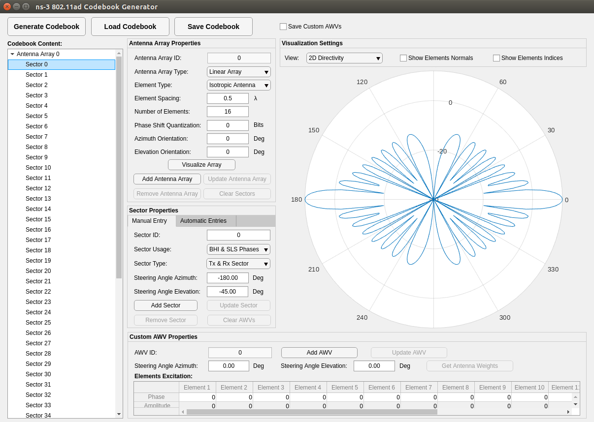

# IEEE 802.11ad Codebook Generator Application
This repository contains a MATLAB application for generating codebook samples for ns-3 IEEE 802.11ad model. These codebook samples are imported into ns-3 using the Parametric Codebook class.
.

